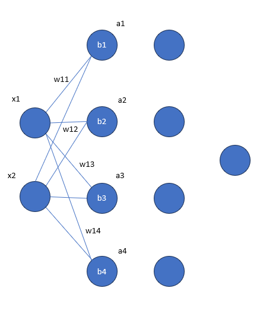

#  Neural Network Mathematics

We will run through the mathematical proof of how a neural network works. You will need:

- Matrices
- Linear Algebra
- Chain Rule
- MSE

If unfamiliar with these please do some research.

### Concept

Neural Networks are designed like the brain with multiple nodes connected by neurons.  

 

## Forward Propogation

This can be represented mathematically through:

The input vector \(x\), weight matrix \(W\), bias vector \(b\), and output vector \(y\) for a neural network connection from two input nodes to four hidden nodes are represented as follows.

The simplified linear equation:
$$
 y = Wx + b =
$$

Matrix Representation:

$$
\begin{bmatrix}
z_{1} \\
z_{2} \\
z_{3} \\
z_{4} \\
\end{bmatrix} = \begin{bmatrix}
w_{11} & w_{12} \\
w_{21} & w_{22} \\
w_{31} & w_{32} \\
w_{41} & w_{42}
\end{bmatrix} \quad \begin{bmatrix}
x_1 \\
x_2
\end{bmatrix} \quad + \quad \begin{bmatrix}
b_1 \\
b_2 \\
b_3 \\
b_4
\end{bmatrix}
$$

If you run through the calculations for y you will find:

$$
\begin{align*}
z_1 &= x_1 \cdot w_{11} + x_2 \cdot w_{12} + b_1 \\
z_2 &= x_1 \cdot w_{21} + x_2 \cdot w_{22} + b_2 \\
z_3 &= x_1 \cdot w_{31} + x_2 \cdot w_{32} + b_3 \\
z_4 &= x_1 \cdot w_{41} + x_2 \cdot w_{42} + b_4
\end{align*}
$$

Once we have a value for y we put it through an activation function. There are many types of actication function, but we will be using sigmoid, which does not allow negative values.

$$
\sigma(a_1) = \frac{1}{1 + e^{-z_1}}
$$

This is applied for each node in each layer in the network. When we can to the final later we calculate the performance using MSE. There are other metrics used, but we will stick with this for now.

$$
\text{MSE} = \frac{1}{n} \sum_{i=1}^n (y_i - \hat{y}_i)^2
$$

## Backpropagation

In order to alter the weights and baises to get a higher score we use the chain rule. First let's differentiate all the quations we've used. 

### Linear Transformation 

$$
z = x \cdot w + b
$$
$$
\frac{\partial z}{\partial w} = x
$$

### Activation Function

$$
a = \sigma(z) = \frac{1}{1 + e^{-z}}
$$
$$
\frac{\partial a}{\partial z} = \sigma(z) \cdot (1 - \sigma(z))
$$

### MSE

$$
\frac{\partial L}{\partial \hat{y}} = \hat{y} - y
$$

### Chain Rule

For the sake of this proof we assume that the final output of y and the activate value a don't change. In reality they do but the equation is a complex linear transformation. 

$$
\frac{\partial L}{\partial w} = \frac{\partial L}{\partial \hat{y}} \cdot \frac{\partial \hat{y}}{\partial a} \cdot \frac{\partial a}{\partial z} \cdot \frac{\partial z}{\partial w}
$$
$$
\frac{\partial L}{\partial w} = (\hat{y} - y) \cdot \sigma(z) \cdot (1 - \sigma(z)) \cdot x
$$

